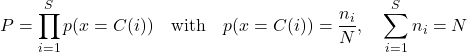

# Federated Clouds: A New Metric for Measuring the Quality of Data Anonymization

## Overview
This repository accompanies the paper **"Federated Clouds: A New Metric for Measuring the Quality of Data Anonymization"** (Gaye et al., 2024, LNCS vol. 14757, Springer).  
[Link to the paper](https://doi.org/10.1007/978-3-031-62488-9_2)

It presents the **mathematical demonstration of the Stabilizer Factor**.
The Stabilizer Factor, denoted as *P*, **adjusts the Shannon index to distinguish between identifiers and evenly distributed categories**, providing a rigorous and robust evaluation of anonymization quality in categorical datasets. 

---

**Definition.** Let *p* be the relative frequency that represents the probability that a value is in category *C(i)*. The stabilizer factor *P* is defined as follows:

\[
P = \prod_{i=1}^{S} p(x = C(i)) \quad \text{with} \quad p(x = C(i)) = \frac{n_i}{N}, \quad \sum_{i=1}^{S} n_i = N
\]

Where:  
- *S* is the total number of categories for the attribute,  
- *n_i* is the count of entries in category *C(i)*,  
- *N* is the total number of entries.

---

## 🔬 Demonstration Cases

### Case 1: Equitable Distribution
- All categories have **equal frequency** *n_1 = n_2 = ... = n_S = 1*.
- **Lemma:** For two equitable distributions of the same attribute with *S_1 < S_2* categories:
*P_1 > P_2*

### Case 2: Non-Equitable Distribution
- Categories have **unequal frequencies**.
- **Lemma:** For two non-equitable distributions of the same attribute with *S_1 < S_2* categories:
*P_1 > P_2*

---

## Key Findings
- **Equitable distribution:** When all categories have the same frequency, the stabilizer factor decreases as the number of categories increases.  
- **Non-equitable distribution:** When category frequencies differ, the factor still decreases with more categories, highlighting sensitivity to uneven distributions.  

 

---

## Reference
**Gaye, Y., Mbaye, M., Diongue, D., Dieng, O., Adetiba, E., Badejo, J.A. (2024).**  
*Federated Clouds: A New Metric for Measuring the Quality of Data Anonymization.*  
In: Habachi, O., Chalhoub, G., Elbiaze, H., Sabir, E. (eds) *Ubiquitous Networking. UNet 2023.*  
Lecture Notes in Computer Science, vol 14757. Springer, Cham.  
[DOI: 10.1007/978-3-031-62488-9_2](https://doi.org/10.1007/978-3-031-62488-9_2)
